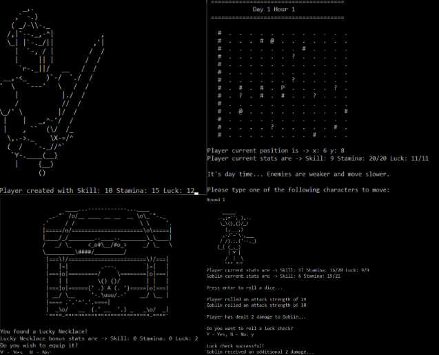

# Decay

### Description

Decay is a simple ASCII console rpg game made in pure C++.

The game and algorithms implemented were created from scratch.

Although simple the game offers navigation around a 2D map, items, traps, enemies, stats, day and night system and 3 difficulties to choose.

This was a prototype (not complete) for university coursework, and I currently have no intention of further developing it.

### Implementation

- The game uses a matrix system to build and navigate a 2D map.
- Class Hierarchy and polymorphism is used so that any shared functionality between classes can derive from the parent.
- Lists, vectors, and arrays are used to save data and objects (enemies, items, traps, etc.).
- Pointers are for referencing objects and to optimize performance.
- The code implementation follows the OOP principles.
- Player movement is a switch case based on player prompted direction, enemy movement is completely random.
- Random functions are used to make the experience different every new game and incentivize replayability.

### Installation

The game requires no installation, you can download the release file [here](https://github.com/jorgebaptista/game-decay/releases/download/v0.2.0/decay-0.2.0-alpha.zip) and play by opening decay.exe file.

### Preview

### License

You are free to use this code anyway you want.
